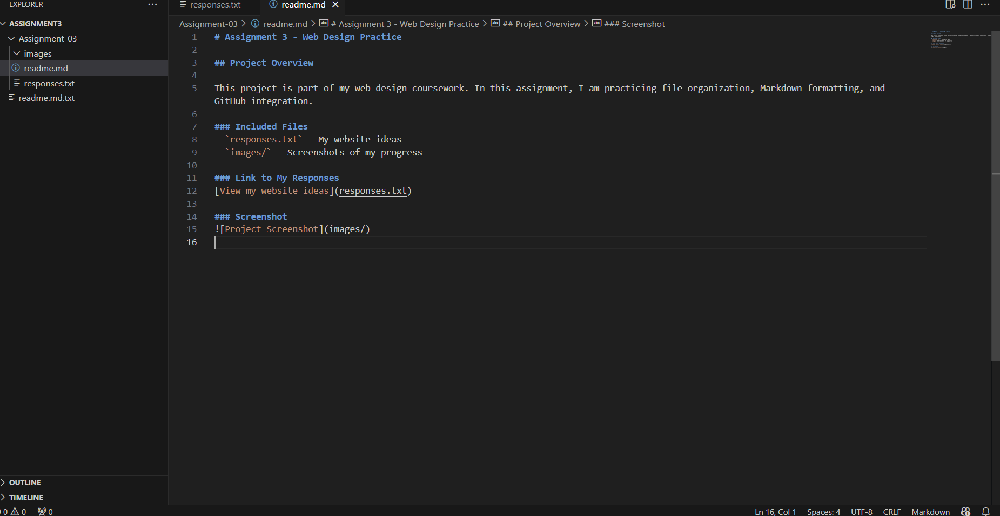
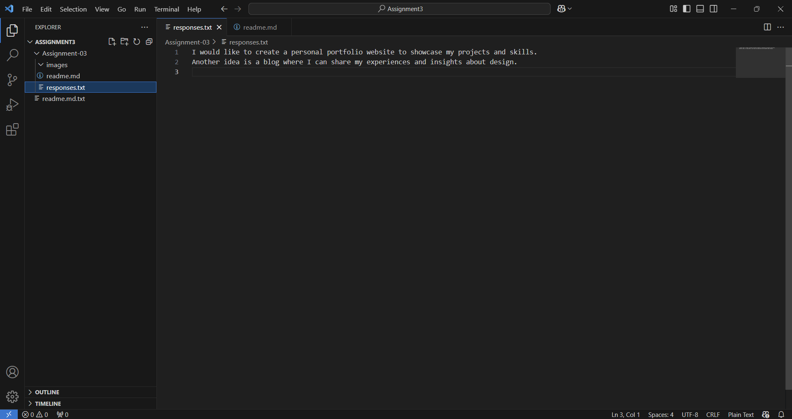

# Assignment 3 - Web Design Practice  

## Project Overview  

This project is part of my web design coursework. In this assignment, I am practicing file organization, Markdown formatting, and GitHub integration.  

### Included Files  
- `responses.txt` – My website ideas  
- `images/` – Screenshots of my progress  

### Link to My Responses  
[View my website ideas](responses.txt)  

### Screenshots  
#### Responses.txt in VS Code  
  

#### README.md in VS Code  
  
